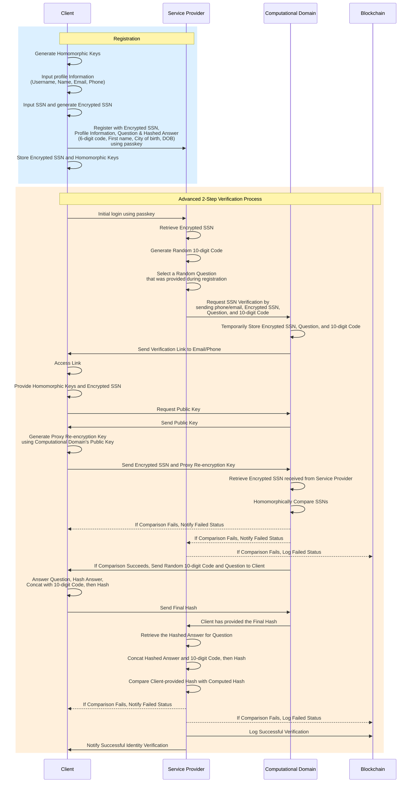

# Advanced Identity Verification Process (Computation Domain)

## Overview

This document outlines the **Advanced Identity Verification Process** involving three key entities: the **Client**, the **Service Provider**, and the **Computational Domain**. The process is divided into two primary sections: **Registration** and **Advanced 2-Step Verification**.

---

## Sequence Diagram

Below is a visual representation of the entire process, depicted in a sequence diagram:

## 1. Registration Process

### 1.1 Overview

The **Registration Process** involves the **Client** securely registering their identity with the **Service Provider**. This process includes generating cryptographic keys, encrypting sensitive data, and storing necessary information for future verifications.

### 1.2 Steps

1. **Homomorphic Key Generation:**

   - The **Client** generates a pair of homomorphic encryption keys on their device. These keys will be used to encrypt sensitive data (e.g., SSN) before transmitting it to the **Service Provider**.

2. **SSN Encryption:**

   - The **Client** uses the homomorphic keys to encrypt their **Social Security Number (SSN)**. This encrypted SSN is essential for future identity verification.

3. **Profile Information Input:**

   - The **Client** inputs their profile information, including:
     - **Username**
     - **Name**
     - **Email**
     - **Phone Number**

4. **Final Data Preparation:**

   - The **Client** generates the final encrypted SSN and gathers all necessary registration information, including a security question and its hashed answer. The hashed answer may be based on personal information like:
     - 6-digit code
     - First name
     - City of birth
     - Date of birth (DOB)

5. **Registration Submission:**

   - The **Client** registers with the **Service Provider** by submitting the following:
     - **Encrypted SSN**
     - **Profile Information**
     - **Security Question & Hashed Answer**
     - **Passkey** for secure submission

6. **Storage:**
   - The **Client** securely stores the homomorphic keys and encrypted SSN on their device for future use.

---

## 2. Advanced 2-Step Verification Process

### 2.1 Overview

The **Advanced 2-Step Verification Process** ensures the **Client's** identity is verified securely using their previously registered information. This process involves the **Service Provider** and **Computational Domain** working together to validate the **Client’s** identity through encrypted SSN comparison and a security question challenge.

### 2.2 Steps

1. **Initial Login:**

   - The **Client** initiates the login process using their **passkey**. The **Service Provider** retrieves the **Client’s** encrypted SSN from its database.

2. **Random Code and Question Generation:**

   - The **Service Provider** generates a **random 10-digit code** and selects a security question that was provided by the **Client** during registration.

3. **SSN Verification Request:**

   - The **Service Provider** sends a request to the **Computational Domain** for SSN verification. The request includes:
     - **Client's Phone/Email**
     - **Encrypted SSN**
     - **Selected Question**
     - **Random 10-digit Code**

4. **Temporary Storage and Verification Link:**

   - The **Computational Domain** temporarily stores the received SSN, question, and 10-digit code. It then sends a verification link to the **Client’s** registered email or phone.

5. **Client Verification:**

   - The **Client** accesses the link, provides their homomorphic keys, and requests the **Computational Domain’s** public key.
   - The **Client** generates a **Proxy Re-encryption Key** using the public key and sends the encrypted SSN and proxy re-encryption key to the **Computational Domain**.

6. **SSN Comparison:**

   - The **Computational Domain** retrieves the SSN received from the **Service Provider** and compares it homomorphically with the **Client’s** encrypted SSN.
   - If the comparison fails, both the **Client** and **Service Provider** are notified, and the failure is logged in the **Blockchain**.
   - If the comparison succeeds, the **Computational Domain** sends the 10-digit code and question to the **Client**.

7. **Final Verification:**

   - The **Client** answers the question, hashes the answer, concatenates it with the 10-digit code, and hashes the result.
   - The final hash is sent to the **Computational Domain**.

8. **Hash Comparison and Final Outcome:**
   - The **Service Provider** retrieves the hashed answer and the 10-digit code, hashes them, and compares the result with the hash provided by the **Client**.
   - If the comparison fails, the **Client** is notified, and the failure is logged in the **Blockchain**.
   - If successful, the verification is logged in the **Blockchain**, and both the **Client** and **Service Provider** are notified of the successful identity verification.

---

### 3. Summary

This **Advanced Identity Verification Process** employs cryptographic techniques like homomorphic encryption to ensure the security of sensitive data. The process is designed to safeguard against unauthorized access, providing a robust solution for identity verification that meets high standards of security and compliance.
